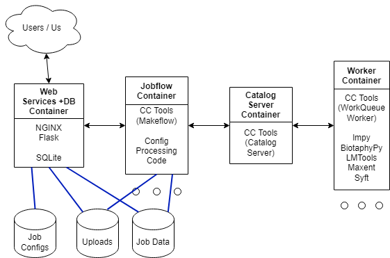

# Containers for Asynchronous Computations

## Design (April 25, 2022)

The design includes four container types as documented below.

## Diagram

Symbology:
* Boxes are individual container types with a title and the main tools on the container
* Arrows indicate communication
* Ellipses indicate that multiple instances of a container can / will exist
* Disk symbols indicate docker volumes

### Containers

#### Web Services Container

The web services container runs some Python web services framework, probably Flask, on top of some web server, like NGINX,
as well as database access.  The job of this container is to coordinate file uploads as well as job metadata interactions
(POST new, PUT updated status, GET outputs, GET job configuration, GET job metadata).

#### Jobflow Container

The jobflow container pulls a job from the database and runs the computations.  This will likely involve translating a
job request from some configuration file (likely JSON) into one or more Makeflow files.  Each instance of the jobflow
container runs a daemon process and continuously pulls jobs to run and runs them before looking for more.

#### Catalog Server Container

The Catalog Server Container runs an instance of the CC Tools Catalog Server.  ALl makeflow instances would register with
the catalog server and advertise available work for the workqueue instances.  Workqueue instances connect to the catalog
server which helps determine which of the running makeflow instances they should connect to.

#### Worker Container

The worker container does the actual computational work.  We would run multiple copies of this image to achieve a level
of parallelism.  Each running container would utilize CC Tools WorkQueue factory to continuously request work via the
catalog server and then individual running makeflows.  The work should use one of the available tools from lmpy, lmtools,
biotaphypy, and syftr.

----

### Example job flow

1. A job request is submitted via a web service call to the `Web Services Container`
2. The `Web Services Container` validates the request
3. The `Web Services Container` catalogs the job request using the `Database Container` and returns a callback URL to the user
4. A `Jobflow Container` pulls a job configuration request.
5. 6. The `Jobflow Container` translates the job request into one or more makeflows
7. Each makeflow registers with the catalog server on the `Catalog Server Container`
8. Instances of `Worker Container` run WorkQueue workers that connect to the catalog server on `Catalog Server Container` to find the makeflow to connect to
9. WorkQueue workers on `Worker Container` instances pull, run, and send back completed tasks to a makeflow on `Makeflow Container`
10. Once all work is complete the `Makeflow Container` catalogs outputs and updates the job status on the `Database Container`
11. Status checks through web services on `Web Service Container` now show that the job is complete and provide an output download URL
12. The user requests and downloads the output package for the job they submitted from `Web Services Container`.
