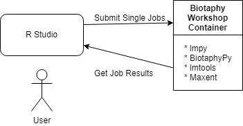

# Biotaphy Workshop Diagram

## Container

This assumes that we will have one container that holds all of the tools that we'll want
to expose for workshops.  These tools are designed to be called individually and any
sort of workflow management is left up to the user.

Libraries available:
 * lmpy - Several scripts for managing data, running SDMs and Multispecies analyses
 * BiotaphyPy - Any tools added for Biotaphy
 * LMTools - Common SDM modeling tool (rare species model or maxent)
 * Maxent - "Bare" Maxent

## Access

We will provide an R library for accessing the tools through RStudio.  This library will
simply spawn an instance of the container image and call the appropriate tool (script).
