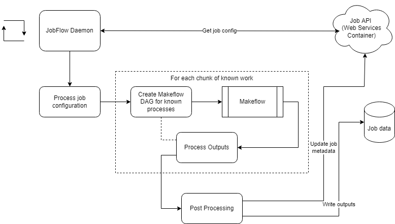

# Diagram of how JobFlow container works

## Diagram

Symbology:
* Rounded boxes are chunks of our Python code
* Right angled rectangle represents Makeflow binary
* Arrows indicate communication
* Disk symbols indicate docker volumes

## Example flow

1. The `JobFlowDaemon` continously runs and requests job configurations from the API (on the web services container)
2. Once a job configuration is ready, it is processed into chunks of work.  Chunks are determined by known work.  Tasks with unknown inputs (because they have to be determined at run-time) are in new chunks (ex. `split_occurrences`).
3. For each chunk, a makeflow DAG is created
4. The `Makeflow` binary is called with the created DAG
5. Outputs created by `Makeflow` are processed and previously unknown inputs for the next chunk are determined
6. Repeat 3 as necessary
7. Final outputs are processed and aggregated
8. A download package is created and stored in the `Job Data` volume
9. The status of the job is updated via an API PUT request
10. The user can then download the job package
